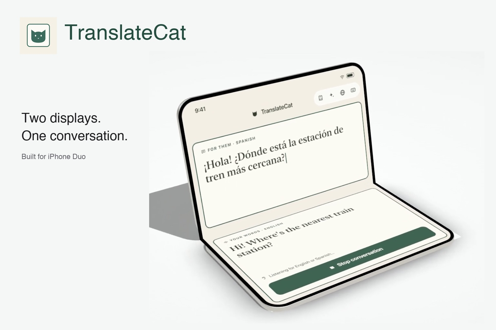

# TranslateCat

**Two displays. One conversation.** A face-to-face translation prototype for the iPhone Duo concept, built for Bitrig Hacks iPhone Duo Edition.



**[Explore the interactive presentation](https://translatecat.vasanth.cloud)** · [Watch the film on YouTube](https://youtu.be/4bWRtc-qeRg) · [Run the presentation locally](#try-the-presentation) · [Build the iOS app](#build-the-ios-app)

[](https://youtu.be/4bWRtc-qeRg)

*Watch the TranslateCat film on YouTube.*

> This is a prototype, not an App Store release. The web presentation demonstrates the idea with simulated conversations; the native SwiftUI app is in this repository.

## How it works

Place the phone between two people. The inner display shows the conversation to the holder; the outer display shows large translated captions to the person across from them. Choose two languages, speak naturally or type a line, and keep a transcript for later.

- **Face-to-face UI:** fold-aware layouts, an outer-display scene accessory, and captions for the opposite speaker.
- **Translation:** hands-free utterance detection with Gemini transcription, language detection, and translation; typed input and Apple Translation are also supported. There are 16 selectable languages.
- **After the conversation:** locally saved transcripts, personal notes, sharing, and optional Pro recaps with a title, key points, and follow-ups.
- **RevenueCat Pro:** a Test Store integration with a hosted paywall and entitlement-based access to summaries.

## Try the presentation

No build step or API key is needed for the browser demo:

```sh
python3 -m http.server 8080 --directory slides
```

Open **http://localhost:8080**. Scroll to unfold the 3D phone and use the navigation dots to explore the supporting slides. The presentation is separate from the iOS app and does not run live translation.

## Build the iOS app

**Requirements:** Xcode 27.1 beta with the iPhone Duo SDK/runtime, or a compatible Bitrig environment. Physical-device builds need your own signing configuration. The checked-in `TranslateCat.xcodeproj` can be opened directly; `project.yml` is available if you prefer XcodeGen.

1. Create a local `Secrets.xcconfig` in the repository root:

   ```xcconfig
   GEMINI_API_KEY = your_own_gemini_api_key
   ```

2. Open `TranslateCat.xcodeproj`, select the **TranslateCat** scheme and a supported iPhone Duo simulator or device, then build and run.
3. Grant microphone and camera permissions when prompted. Apple Translation and Foundation Models features depend on the device, runtime, downloaded language packs, and model availability.

`Config.xcconfig` optionally includes the Git-ignored `Secrets.xcconfig`. Without a Gemini key, online translation reports a setup error; typed translation can fall back to Apple Translation when supported. This prototype calls Gemini directly from the app, so even a key supplied through build configuration can be extracted from a distributed binary. **Do not ship it that way:** put Gemini behind an authenticated server-side proxy for production and never commit credentials.

## RevenueCat integration

The native app uses the RevenueCat iOS SDK and RevenueCatUI:

| Capability | Implementation |
| --- | --- |
| Test Store SDK configuration | `SubscriptionModel.swift` configures `Purchases` with a **public client-side Test Store key**. It is not a RevenueCat secret API key. |
| Offerings and packages | Loads the current offering and exposes its available packages; a custom purchase method is implemented. |
| Hosted paywall | `RevenueCatUI.PaywallView` opens from Pro upsells and closes after a successful Pro purchase or restore. |
| Purchases and restore | Uses `purchase(package:)` and `restorePurchases()`; surfaces cancellation and common purchase errors. |
| Entitlement gating | Observes `customerInfoStream` and checks the `translatecat_pro` entitlement to unlock conversation summaries. |

The source anticipates monthly, yearly, and lifetime packages, but the actual products and prices depend on the RevenueCat dashboard offering. This repository does **not** verify which packages are configured or prove a completed purchase. Shipping requires your own App Store products, RevenueCat production configuration, and an appropriate public App Store SDK key. Never put a RevenueCat **secret** API key in an iOS app.

## Data and limitations

Conversations and notes are saved locally on the device; the app does not retain recorded audio. The hands-free path sends speech audio to Gemini, and online recap generation sends transcript text and the owner's note. On-device Apple Translation and Foundation Models paths depend on supported hardware, runtime, and downloaded models. The browser presentation uses simulated conversations.

## Repository map

- [`TranslateCat/`](TranslateCat/) — SwiftUI app, speech and translation flows, local history, recaps, and RevenueCat integration.
- [`TranslateCat.xcodeproj/`](TranslateCat.xcodeproj/) and [`project.yml`](project.yml) — Xcode project and XcodeGen source.
- [`slides/`](slides/) — interactive presentation, Three.js scene, video, and images.
- [`wrangler.jsonc`](wrangler.jsonc) — Cloudflare deployment configuration for the presentation.

The bundled Three.js files carry an MIT license; see [`slides/vendor/LICENSE`](slides/vendor/LICENSE). To deploy the presentation to your own domain, update the Worker account, name, and custom domain in `wrangler.jsonc`, then run `wrangler deploy` with Wrangler v4 and the relevant Cloudflare account.
